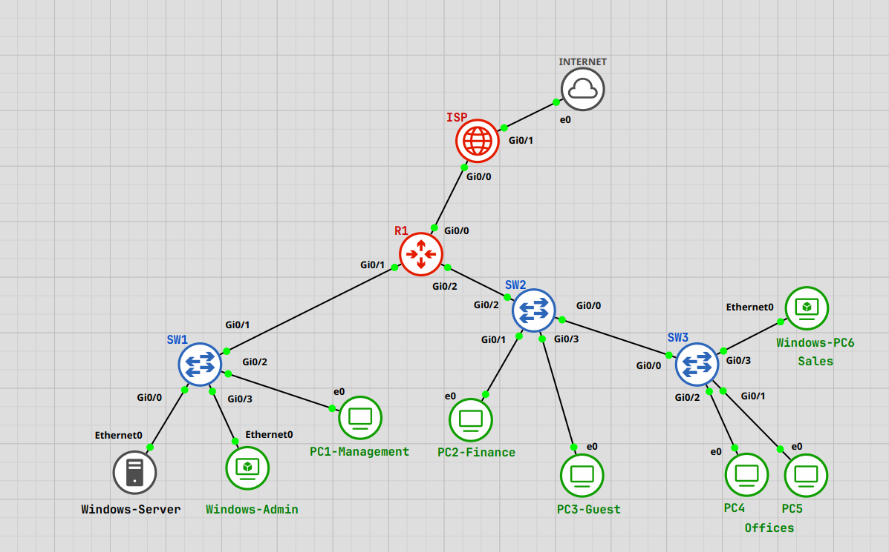

# **Small Office Network Infrastructure**

 

## **Introduction and Objectives**

This project presents a complete small office network, designed as part of my study portfolio and my first full infrastructure project in a virtualized GNS3 environment. 
The network uses VLAN segmentation, inter-VLAN routing, static routing with ip route, DHCP services, NAT/PAT translation, and ACL security rules. Basic device security, SSH access, port roles, and controlled communication between VLAN segments are also included.. All implemented functions follow the design and the network operates as one stable and functional system.

The goal of the project is to simulate a realistic small office environment with separated VLAN areas, Windows Server services, private-to-public translation, and managed access between segments.  
The project also demonstrates practical work with GNS3 VMs, Cisco IOSv/IOL2 images, and system-level troubleshooting inside a virtual network topology.

 

## **Topology Diagram**

 

## **Network Zones**

The network is divided into several simple functional zones:

- **ISP Zone** – simulated internet router for external communication
    
- **Server Zone** (VLAN 10) **– Windows Server for DHCP and testing
    
- **Admin Zone (VLAN 10)** – Windows-Admin workstation with full access
    
- **User VLANs** – Finance (VLAN 20), Guest (VLAN 30), Offices (VLAN 40), Management (VLAN 50), Sales (VLAN 60)
    
- **Routing/Switching Zone** – Router R1 and all switching interconnections
    

*Zones help visualize which devices communicate together (for example PC4 and PC5 inside VLAN 40).*

 

## **Project Structure**

1. [Network Topology and Devices](01-network-topology-and-devices.md)
    
2. [Addressing and VLAN Planning](02-addressing-and-vlan-planning.md)
    
3. [Basic Device Configuration](03-basic-device-configuration.md)
    
4. [VLAN Configuration](04-vlan-configuration.md)
    
5. [Inter-VLAN Routing](05-inter-vlan-routing.md)
    
6. [DHCP Configuration](06-dhcp-configuration.md)
    
7. [NAT/PAT and Static Routing](07-nat-pat-and-static-routing.md) 
    
8. [Network Security](08-network-security.md)
    
9. [Troubleshooting](09-troubleshooting.md)
    
10. [Conclusion and Summary](10-conclusion-and-summary.md)
    

 

## **Used Tools**

- **GNS3 version 2.2.54**
    
- **Xubuntu VM** (kernel-based QEMU virtual machine inside GNS3)
    
* **Windows Server 2022 VM** (DHCP, testing)
    
- **Cisco IOSv Router**
    
    - *VIOS-ADVENTERPRISEK9-M, Version 15.9(3)M6*
        
- **Cisco IOSv-L2 Switch**
    
    - *vios_l2-ADVENTERPRISEK9-M, Version 15.2(20170321)*
        
- **Visual Studio Code** (documentation editing)
    
- **Obsidian** (notes, summaries and screenshots)
    

 

## **Key Project Features**

* Static routing with ip route
    
- VLAN segmentation and Trunk links 
    
- Inter-VLAN routing using subinterfaces
    
* DHCP relay from all VLANs to Windows Server
    
- NAT/PAT translation to the public address of R1
    
* Basic security (passwords, enable secret, SSH access)
    
- Structured ACL policy controlling communication between VLAN segments
    
- Connectivity testing across all networks with full diagnostics steps
    
- Troubleshooting demonstrations (VLAN issues, wrong trunk, NAT mismatch, ACL order)
    

 

## **Author’s Note**

This is my first GNS3 project, and building it was an important step forward in my networking studies.  
Before this project, I completed several GNS3 labs, which helped me understand the environment, but creating a full multi-device topology was something completely new.

During the work, I solved real issues such as VLAN issues, incorrect trunking, NAT/PAT translation problems and wrong ACL rules. Fixing these issues made the project more realistic and gave me a stronger understanding of how routing, switching and services work together in a virtual environment.

The final result is a stable small office network that matches the design and provides a solid technical base for future projects. I look forward to building more complex topologies, adding new services, and pushing the limits of what I can create in GNS3.

---

© 2025 – Lukas Dula | Home Network Project & Portfolio
